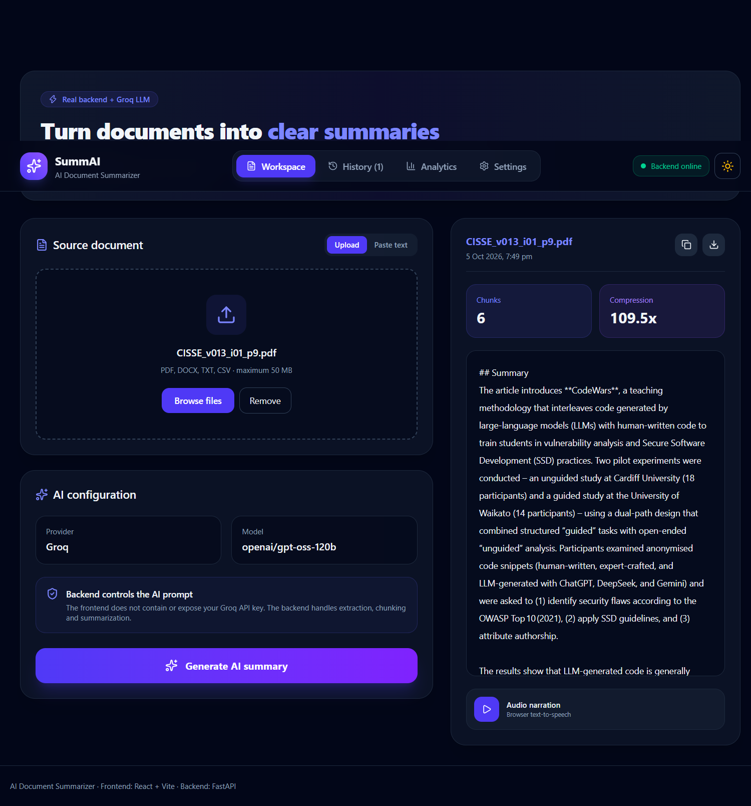
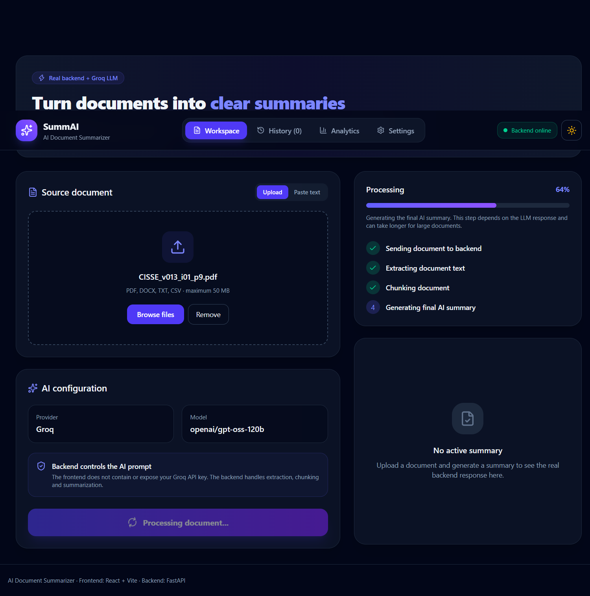
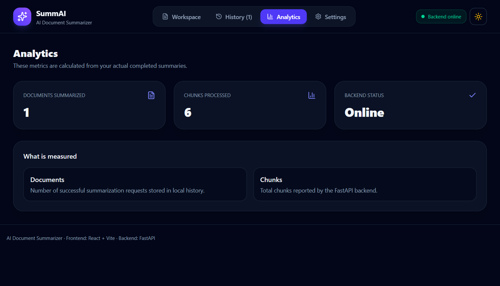
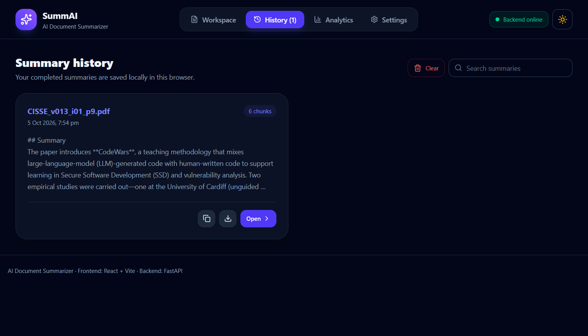

# AI Document Summarizer

An AI-powered full-stack document summarization application that allows users to upload documents, extract their content, process large documents through intelligent chunking, and generate concise summaries using a Groq-hosted LLM.

## Overview

AI Document Summarizer is a full-stack Generative AI project built to explore practical LLM application development.

The application accepts multiple document formats, extracts their text, divides large documents into manageable chunks, summarizes each chunk using an LLM, and then combines those summaries into a final document summary.

The project also provides a React-based interface where users can upload documents, view generated summaries, maintain local summary history, export results, and listen to summaries using browser text-to-speech.

## Features

* Upload and process multiple document formats
* Supports:

  * PDF
  * DOCX
  * TXT
  * CSV
* Automatic document text extraction
* Large-document chunking
* LLM-powered summarization using Groq
* Multi-stage summarization:

  * Chunk-level summaries
  * Final combined summary
* FastAPI backend
* React frontend
* REST API architecture
* Drag-and-drop file upload
* Paste text for summarization
* Summary history stored locally in the browser
* Copy generated summaries
* Export summaries as TXT/Markdown
* Browser-based audio narration
* Play, pause, resume, and stop controls
* Backend health/status indicator
* File type validation
* Environment-variable based API configuration

## Architecture

The application follows a frontend-backend-service architecture.

```text
User
 │
 ▼
React Frontend
 │
 │ HTTP Request
 ▼
FastAPI Backend
 │
 ├── File Upload & Validation
 │
 ▼
File Handler
 │
 ├── PDF
 ├── DOCX
 ├── TXT
 └── CSV
 │
 ▼
Extracted Text
 │
 ▼
Text Chunker
 │
 ▼
LLM Summarization
 │
 ├── Chunk Summaries
 │
 ▼
Final Summary Generation
 │
 ▼
FastAPI Response
 │
 ▼
React UI
```

## Tech Stack

### Frontend

* React
* Vite
* JavaScript / JSX
* Tailwind CSS
* Lucide React

### Backend

* Python
* FastAPI
* Uvicorn

### AI / LLM

* Groq API
* `openai/gpt-oss-120b`

### Document Processing

* PyPDF
* python-docx
* Python CSV module

## Project Structure

```text
ai-document-summarizer/
│
├── backend/
│   ├── api/
│   │   ├── __init__.py
│   │   └── routes.py
│   │
│   ├── services/
│   │   ├── __init__.py
│   │   ├── file_handler.py
│   │   ├── chunker.py
│   │   └── summarizer.py
│   │
│   └── main.py
│
├── frontend/
│   ├── src/
│   │   ├── App.jsx
│   │   └── ...
│   ├── package.json
│   └── ...
│
├── .env.example
├── .gitignore
├── requirements.txt
└── README.md
```

## How It Works

### 1. Upload a document

The user uploads a supported document through the React frontend.

### 2. File validation

The frontend and backend validate the file type before processing.

### 3. Text extraction

The backend extracts readable text depending on the document format.

### 4. Text chunking

Large documents are divided into smaller overlapping chunks so that they can be processed within the LLM's context and token limitations.

### 5. Chunk summarization

Each chunk is sent to the Groq LLM and summarized independently.

### 6. Final summarization

The generated chunk summaries are combined and sent to the LLM again to create one coherent final summary.

### 7. Display and export

The final summary is returned to the React frontend where users can read, copy, export, or listen to it using browser text-to-speech.

## API Endpoints

### Health Check

```http
GET /api/v1/health
```

Used to check whether the backend is running.

### Model Information

```http
GET /api/v1/models
```

Returns the configured model and supported document formats.

### Summarize Document

```http
POST /api/v1/documents/summarize
```

Accepts a document as multipart form data and returns the generated summary.

Example response:

```json
{
  "filename": "document.pdf",
  "summary": "Generated document summary...",
  "chunks": 4,
  "model": "openai/gpt-oss-120b"
}
```

## Installation

### Prerequisites

Make sure you have:

* Python 3.10+
* Node.js and npm
* A Groq API key

### Backend Setup

Clone the repository:

```bash
git clone https://github.com/samiksha-01-code/ai-document-summarizer.git
cd ai-document-summarizer
```

Create and activate a virtual environment:

```bash
python -m venv .venv
```

Windows:

```bash
.venv\Scripts\activate
```

Install dependencies:

```bash
pip install -r requirements.txt
```

Create a `.env` file:

```env
GROQ_API_KEY=your_groq_api_key_here
VITE_API_BASE_URL=http://127.0.0.1:8000
```

### Start the Backend

From the project root:

```bash
uvicorn backend.main:app --reload
```

The API will run at:

```text
http://127.0.0.1:8000
```

FastAPI documentation:

```text
http://127.0.0.1:8000/docs
```

### Frontend Setup

Open another terminal:

```bash
cd frontend
npm install
npm run dev
```

The Vite development server will provide the frontend URL shown in the terminal.

## Environment Variables

| Variable            | Description                         |
| ------------------- | ----------------------------------- |
| `GROQ_API_KEY`      | API key used to access the Groq LLM |
| `VITE_API_BASE_URL` | Base URL of the FastAPI backend     |

Never commit your actual `.env` file or API keys to GitHub.

## Current Limitations

* Summarization currently depends on the availability and rate limits of the configured LLM API.
* Text extraction quality depends on the structure of the uploaded document.
* Scanned/image-only PDFs may require OCR support, which is not currently included.
* Chunking is currently character-based rather than token-aware.
* Browser text-to-speech depends on the capabilities of the user's browser and operating system.

## Future Improvements

* Add OCR support for scanned PDFs
* Implement token-aware chunking
* Add streaming LLM responses
* Add authentication and user accounts
* Store summaries in a database
* Add persistent cloud-based document history
* Add more document formats
* Improve table and structured-data extraction
* Add RAG-based question answering over uploaded documents
* Add configurable summarization styles and lengths
* Deploy the frontend and backend

## Learning Goals

This project was built to gain practical experience with:

* Generative AI application development
* LLM APIs
* Prompt engineering
* Document processing
* Text chunking
* FastAPI
* REST API design
* React frontend development
* Frontend-backend integration
* Environment variable management
* Building portfolio-ready AI applications

## Screenshots

### Dashboard



### Document Processing



### Analytics and history




## Author

**Samiksha Chaudhari**

GitHub: [samiksha-01-code](https://github.com/samiksha-01-code)
